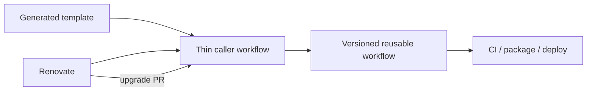

# Shared Workflow Contracts

Generated projects keep small caller workflows and delegate CI/CD behavior to
versioned reusable workflows in this repository. Callers pin a release tag,
for example:

```yaml
jobs:
  ci:
    uses: ShawnDen-coder/repo-scaffold/.github/workflows/reusable-python-ci.yaml@0.27.0
```

## Design

The system deliberately separates workflow invocation from workflow
implementation:



Templates own repository-specific policy: trigger events, permissions,
toolchain versions, profile flags, and secrets mapping. The reusable workflow
owns repeatable implementation: setup, caching, linting, testing, publishing,
and release creation. Renovate upgrades the pinned reusable-workflow tag and
lets the repository validate the change through its normal pull request.

This keeps workflow fixes centralized without silently changing every consumer.
It also gives each repository an ordinary Git history and rollback point.

## Consumer lifecycle

1. `repo-scaffold create` renders a thin caller with a released workflow tag.
2. A workflow implementation fix is released from this repository.
3. Renovate detects the new tag and opens an upgrade pull request.
4. The consumer runs its own CI and merges or rejects the upgrade.
5. A breaking contract change uses a new major version and requires a caller update.

## Profiles

| Profile | CI workflow | Release workflow |
| --- | --- | --- |
| Python | `reusable-python-ci.yaml` | `reusable-python-release.yaml` |
| uv workspace | `reusable-python-ci.yaml` | `reusable-python-release.yaml` |
| TS SDK | `reusable-node-ci.yaml` | `reusable-node-release.yaml` |
| React | `reusable-node-ci.yaml` | `reusable-node-release.yaml` |
| pnpm workspace | `reusable-node-ci.yaml` | Not applicable; workspace is private |
| Vue | `reusable-node-ci.yaml` | Not applicable; application is private |
| Rust | `reusable-rust-ci.yaml` | `reusable-rust-release.yaml` |

## Versioning contract

Workflow changes follow the repository SemVer release:

- Patch releases fix implementation details without changing caller inputs.
- Minor releases add backward-compatible inputs or capabilities.
- Major releases remove or rename inputs, secrets, or workflow files.

Callers should use an exact release tag. Renovate upgrades those references in
normal pull requests; do not point production callers at `main`.

## Inputs and secrets

Python CI accepts a JSON `python-versions` matrix, a `workspace` flag, and an
optional `test-container` flag with `containerfile`. Python release accepts a
release `tag`, `workspace`, `deploy-docs`, and `publish-container`. Node release
accepts `tag`, build and publish flags, and an optional GitHub Packages name.
Rust release accepts `tag`, `crate-name`, and `publish-crates`.

Secrets are passed by the caller and are never stored in template manifests.
Only grant package or contents write permission to the release workflows that
need it.

## Adding a workflow change

1. Update the reusable workflow and its contract tests.
2. Render every affected template and inspect the caller YAML.
3. Run `uvx pre-commit run --all-files` and `uv run --extra dev pytest -q tests/`.
4. Merge and publish the next repo-scaffold version.
5. Let Renovate create upgrade PRs for consumers.

The Airflow workspace uses `workspace: true` and can pass
`containerfile: ./docker/Dockerfile` when enabling container checks.
